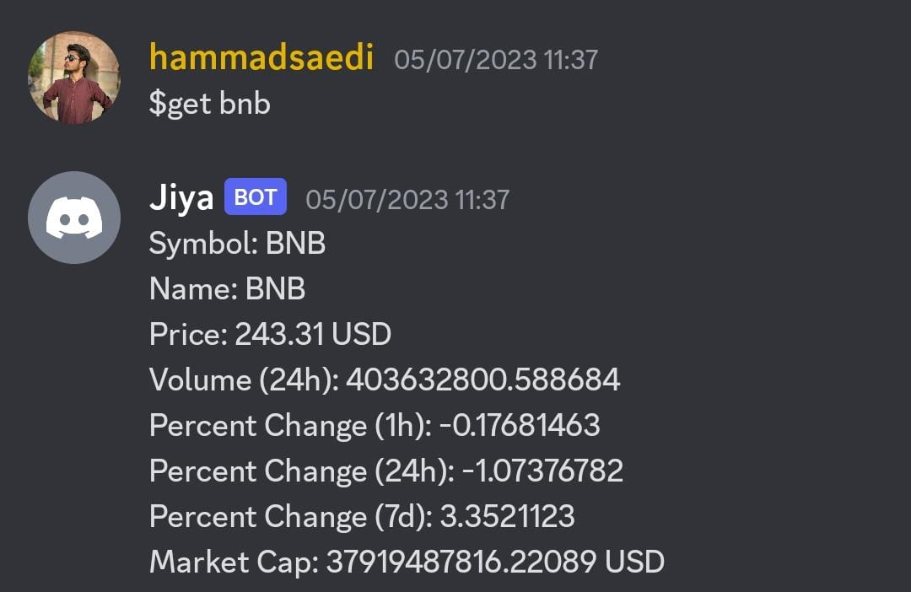
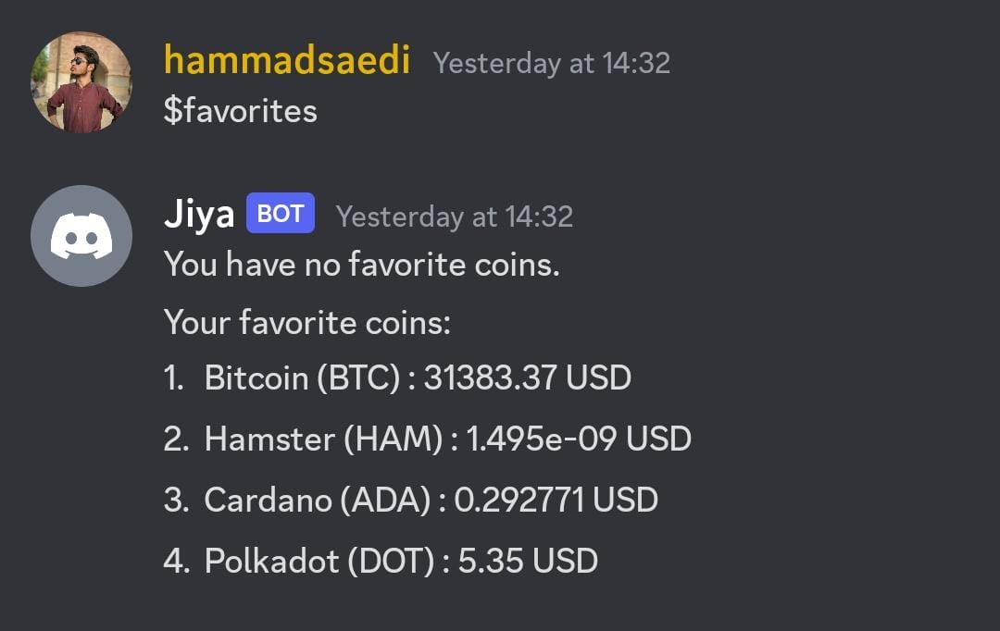
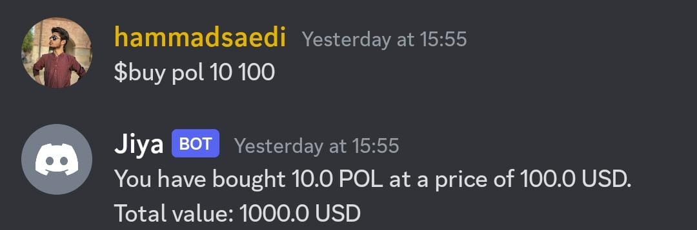
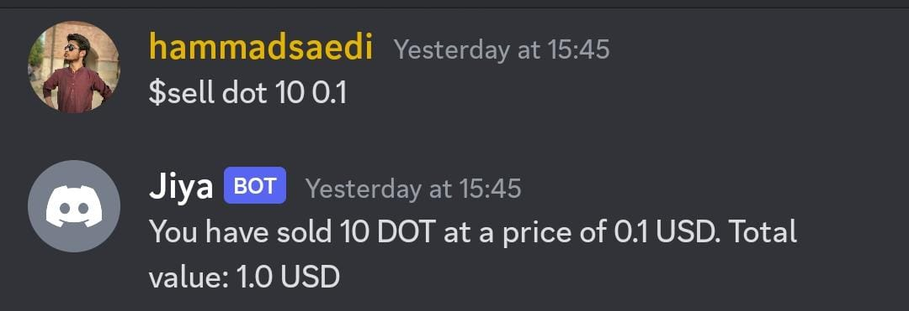
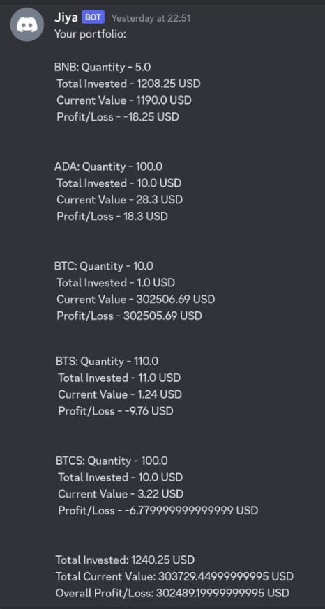
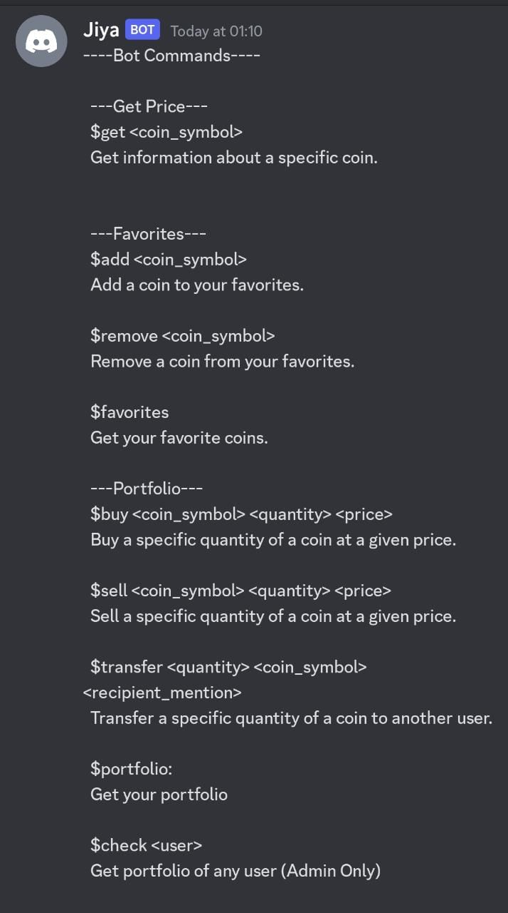

# Jiya - Cryptocurrency Discord Bot

Jiya is a Discord bot designed to perform various cryptocurrency-related tasks, including retrieving coin information, managing favorites, buying and selling coins, tracking portfolios, and facilitating transfers between users. The bot utilizes the Discord.py library to interact with the Discord platform and integrates with the CoinMarketCap API to fetch real-time cryptocurrency data.

## Features

- *Retrieve Coin Information*: Users can retrieve detailed information about cryptocurrencies, such as current price, market cap, and trading volume, using the bot's commands.

- *Manage Favorite Cryptocurrencies*: Jiya allows users to create and manage a list of their favorite cryptocurrencies, making it easier to keep track of coins of interest.

- *Simulate Buying and Selling*: The bot provides a simulated buying and selling feature, enabling users to specify the coin, quantity, and price to assess potential outcomes.

- *Track and Manage User Portfolios*: Jiya enables users to track and manage their cryptocurrency portfolios, providing an overview of their holdings, including the quantity and value of each coin.

- *Transfer Cryptocurrencies*: Users can transfer cryptocurrencies to other users within the Discord server, facilitating seamless exchanges between members.

Jiya simplifies cryptocurrency-related tasks within Discord communities, offering valuable insights and tools for managing digital assets.

## Requirements

- Python 3.7 or higher
- Replit (for running the bot)

## Dependencies

The project utilizes the following dependencies:

- Discord.py
- Flask
- CoinMarketCap
- other dependencies listed in `pyproject.toml`

## Environment Variables

To run this project, you will need to add the following environment variables. In Replit, navigate to the "Secrets" tab in the left sidebar.
- `BOT_TOKEN` Discord Bot Token
- `CMC_TOKEN` CoinMarketCap API Key.

## Installation

To run the Jiya bot, follow these steps:

1. Click on the "Create Repl" button from the sidebar.
2. In the menu to create a new repl, press the "Import from GitHub" button in the top-right corner.
3. Copy the URL of GitHub repository and paste it into the text field.
4. Press the "Import" button.
5. Ensure your Replit project is using Python 3.7 or higher.
6. Set up the environment variables:
   - In Replit, navigate to the "Secrets" tab in the left sidebar.
   - Add a new secret with the key `BOT_TOKEN` and the value being your actual Discord bot token.
   - Add a new secret with the key `CMC_TOKEN` and the value being your actual CoinMarketCap api key.
7. Start the bot:
   - Open the `main.py` file.
   - Click the "Run" button in Replit to start the bot.

## API Reference

For detailed information about the internal API and utility functions used in the Jiya bot, please refer to the `API_Reference.md` file. It provides comprehensive documentation and guidelines for developers who want to understand and utilize the Jiya API.

## Contributing

Thank you for considering contributing to the Jiya project! Contributions are always welcome and greatly appreciated. To get started, please refer to the `contributing.md` file. It outlines various ways in which you can contribute to the project and provides guidelines to follow when making contributions.

We kindly ask all contributors to adhere to the project's code of conduct. By participating in this project, you are expected to uphold the principles of respect, inclusivity, and professionalism.

## Usage

To interact with the Jiya bot, please refer to the `User_Guide.md` file. It provides detailed instructions and examples on how to use each command and functionality offered by the Jiya bot. Whether you want to retrieve coin information, manage favorites, simulate buying and selling, track portfolios, or transfer coins, the user guide will provide you with the necessary guidance.

## Demo

### Get Price

### Add to Favorite

### Remove from Favorite

### Get Favorite

### Buy Coin

### Sell Coin

### Get Portfolio

### Help

## Recommendation

Following features and enhancements are recommended for the Jiya project:

### Web Panel
- Develop a web-based panel for administrators to manage the Jiya bot.
- Add a broadcast message feature to send messages to all servers.
- Implement server-specific messaging functionality.

### Ads
- Introduce an ads message feature for administrators to send promotional messages.
- Provide customizable ad templates.
- Consider adding scheduling options for ad messages.

### Web Authentication
- Implement authentication for the web panel.
- Set different access levels for marketing team and administrators.

These recommendations aim to improve the functionality and user experience of the Jiya bot, allowing administrators to efficiently manage and engage with users. Please note that these recommendations require careful planning and development to integrate them into the existing Jiya project.

## Lessons Learned

During the development of the Jiya project, several soft lessons were learned and valuable insights were gained. Here are some key takeaways:

1. **Effective Communication**: Clear and open communication is essential for successful collaboration. It is important to establish effective channels of communication, provide timely updates, and actively listen to team members' feedback and ideas.

2. **Adaptability**: The development process often requires adapting to new technologies, tools, and methodologies. Being open to learning and embracing change is crucial for staying current and improving skills.

3. **Problem-Solving**: Building a complex project like Jiya inevitably involves encountering challenges and obstacles. Developing strong problem-solving skills and a proactive mindset helps in overcoming these challenges and finding innovative solutions.

4. **Documentation and Documentation**: Documenting the project thoroughly, including code comments, API references, and user guides, promotes clarity, maintainability, and ease of use. It helps team members understand the project and assists users in utilizing its features effectively.

5. **Collaboration and Teamwork**: Working as a team fosters creativity, shared responsibility, and a sense of community. Emphasizing collaboration, encouraging diverse perspectives, and leveraging each team member's strengths greatly contribute to the success of the project.

6. **Continuous Learning**: The development process is an opportunity for continuous learning and growth. Embracing a growth mindset, seeking out new knowledge, and staying updated with the latest industry trends enhance professional development.

By reflecting on these soft lessons and incorporating them into future projects, the Jiya team can further improve their skills, processes, and project outcomes.

## Acknowledgements

- [Discord.py](https://discordpy.readthedocs.io/): Python library for creating Discord bots.
- [CoinMarketCap API](https://coinmarketcap.com/api/): API for retrieving cryptocurrency data.

## Authors

- [@hammadsaeedi](https://www.github.com/hammadsaeedi)
- [@fasiiha](https://www.github.com/fasiiha)

## License

[MIT](https://choosealicense.com/licenses/mit/)
